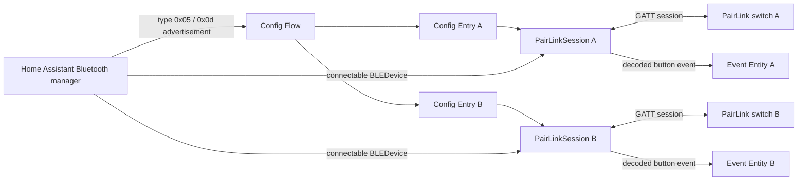
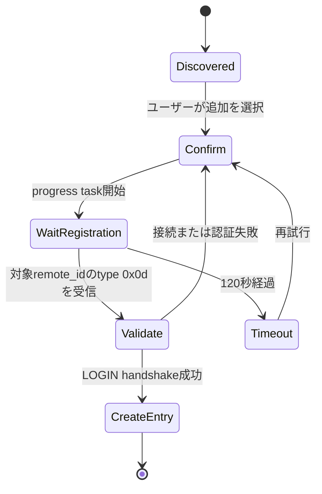
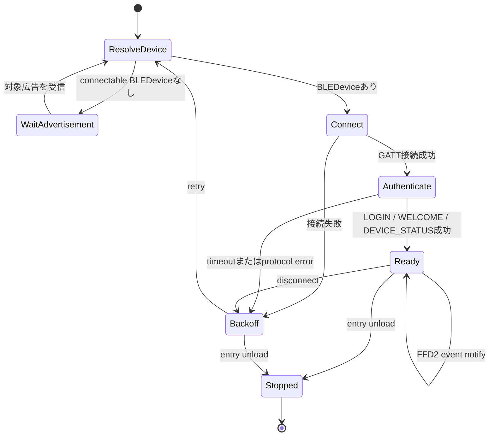

# PairLink Home Assistant Custom Integration 設計書

## 1. 目的

PairLink対応スイッチへHome Assistantから照明側BLE Centralとして接続し、物理的な
ON/OFF操作をHome Assistantのイベントとして利用可能にする。

このintegrationは次を満たす。

- Android APK、JNI、native `.so`へ依存しない
- Home ID、password、BLE addressをハードコードしない
- UI上のConfig Flowだけで初期登録できる
- 1台のBluetooth adapterから複数スイッチへ並行接続できる
- スイッチごとにON/OFFの送信元を識別できる
- 切断・Home Assistant再起動後に自動復旧する
- credentialや実機固有情報を通常ログ・diagnosticsへ露出しない

### 1.1 対応範囲外

このintegrationはPairLink壁スイッチからのイベント受信だけを対象とする。次の機能は
実装しない。

- PairLink電球を直接操作する`light`エンティティ
- Home AssistantからのBLE広告送信
- GATT Peripheral / GATT Serverの公開
- BlueZ D-Busを直接操作する独自Bluetooth backend
- 専用Home Assistant Appや外部Raspberry Pi daemon

PairLink電球はBLE Centralとして模擬スイッチPeripheralへ接続する。そのため電球を
直接制御するには、Home Assistantが公式にintegrationへ提供するScanner / GATT Client
APIの範囲を超えた実装が必要になる。self-contained性、Home Assistant環境間の可搬性、
Production環境の安定性を優先し、電球の直接制御は将来TODOではなく明示的な非対応範囲
とする。

壁スイッチのEvent Entityは、Home Assistantへ別途登録済みの照明などを操作する
オートメーションのトリガーとして利用できる。

## 2. 前提と確認済み事項

プロトコルの詳細は`PROTOCOL.md`、2台同時接続の実測結果は
`MULTI_SWITCH_VALIDATION.md`を正とする。

確認済みの通信モデル:

```text
Home Assistant / light emulator       PairLink switch
BLE Central                           BLE Peripheral
       |                                      |
       |------------- connect -------------->|
       |------------- LOGIN ---------------->|
       |<------------ LOGIN response --------|
       |------------- WELCOME -------------->|
       |------------- DEVICE_STATUS -------->|
       |<------------ encrypted event -------|
```

スイッチは通常広告だけでボタン操作を送らない。常時GATT接続し、FFD2 notificationを
受信する必要がある。

## 3. Home Assistant上の表現

### 3.1 Config Entry

**1スイッチを1 Config Entryとして扱う。**

理由:

- スイッチごとにHome ID/password、GATT接続、LOGIN状態が独立している
- 1台だけの再設定、削除、再認証、availability管理が自然に行える
- Home AssistantのDevice Registry上でも物理スイッチ1台が1 deviceになる
- 2台以上は複数Config Entryを並行ロードすればよく、独自の「親hub entry」は不要

Home Assistantはruntime objectを`ConfigEntry.runtime_data`へ型付きで格納することを
推奨しているため、各entryのruntime dataには`PairLinkSession`を保持する。

### 3.2 Device

Config EntryごとにDevice Registryへ1 deviceを作る。

```text
identifier:  (pairlink, remote_id_hex)
connection:  Bluetooth address
name:        PairLink switch
model:       PairLink-compatible switch
```

`remote_id`から復元した正規switch MACをConfig Entryのunique IDとし、Device/Entityの
内部identifierは既存Entityとの互換性のため`remote_id_hex`を維持する。両者は1対1であり、
どちらもAP sourceを含まない。BLE addressは接続情報として扱う。現在の実機では
`remote_id`から復元したMACとBLE addressが一致したが、将来のaddress randomizationを
考慮して同一とは決め打ちしない。

### 3.3 Entity

各deviceにEvent Entityを1つ作る。

```text
platform:       event
device_class:   button
event_types:    ["on", "off"]
suggested name: Button
```

Home AssistantのEvent Entityは、リモコンなどの物理ボタン押下を表現するための
stateless entityである。`_trigger_event()`で次の属性を付ける。

```json
{
  "channel": 1,
  "command": 1,
  "command_hex": "0x01",
  "extra": "00",
  "repeat_count": 1
}
```

接続確立前または切断中はEvent Entityをunavailableとする。各スイッチには診断用の
受信信号強度Sensor Entityを作り、Bluetooth広告から得た最新RSSIをdBmで公開する。
最初の広告受信前はこのSensor Entityをunavailableとする。接続状態・再接続回数など、
RSSI以外の診断情報はdiagnosticsで提供する。

## 4. 全体構成



広告受信とadapter選択はHome AssistantのBluetooth managerへ委譲する。integrationが
独自の`BleakScanner`を起動してはならない。

### 4.1 Bluetooth Proxy互換性

接続経路はlocal adapterとremote Bluetooth proxyを区別せず、Home Assistantの
Bluetooth Managerが返すconnectableな`BLEDevice`として扱う。

- `BLEDevice.details`やbackend固有classを参照しない
- `hci0`、BlueZ D-Bus、scanner sourceの形式を前提にしない
- 接続のたびに`async_ble_device_from_address(..., connectable=True)`で経路を解決する
- proxy切断や経路変更後も、保存したswitch addressとcredentialで再解決する
- 1スイッチにつき常時connection slotを1つ使用する

これにより、将来ESPHomeなどの接続可能なBluetooth proxyへ移行できる余地を維持する。
listen-only proxyはGATT接続できないため対象外とする。local adapterからproxyへの
failoverを含む実機acceptanceは、対応機材を導入した時点で追加する。

### 4.2 Aruba AP経路と複数AP

Aruba APは`aruba_ble_proxy`がAP reporter MACごとのconnectable scannerとしてBluetooth
Managerへ登録する。PairLink integrationはArubaのruntimeやAP一覧を直接参照しない。

```text
AP-A scanner ─┐
              ├─ Home Assistant Bluetooth Manager ─ PairLinkSession(switch MAC)
AP-B scanner ─┘
```

- 同じswitch MACを複数APがforwardしてもPairLink Config Entryは1つ
- AP MACは永続identityへ含めず、接続ごとに解決されるtransport routeに限定
- active接続が切れた場合、次のattemptで`async_ble_device_from_address()`を再実行
- Bluetooth ManagerがAP-Bを返せば同じSession/Device/Entityで再接続
- 接続中のAP間ローミングは行わず、切断を境界とするbreak-before-make
- APごとのactive connection slotは`aruba_ble_proxy`側が管理

AOS 8.13実機ではidle接続が明示的statusなしに失われたため、PairLinkSessionはREADY中に
60秒間隔でGAP Device Name (`1800`/`2A00`)をreadする。read成功はWebSocketだけでなく
AP・BLE link・GATT応答の往復を確認し、keepaliveも兼ねる。失敗は通常のsession failure
としてcleanupと経路再解決を起動する。

`aruba_ble_proxy 1.1.1`のencoderは16-bit UUIDをBluetooth Base UUIDへ展開するが、AOS
8.13のGATT cacheはnative 2-byte UUIDを要求した。`aruba_compat.py`はPairLinkとhealth
checkで使用するUUIDだけを2-byteへ変換する。encoderが既にnative形式を返す版では何も
変更しない。

## 5. ディレクトリ構成

domainは会社名を含めず`pairlink`とする。

```text
custom_components/pairlink/
├── __init__.py
├── manifest.json
├── const.py
├── config_flow.py
├── models.py
├── protocol.py
├── discovery.py
├── aruba_compat.py
├── session.py
├── event.py
├── diagnostics.py
└── translations/
    ├── en.json
    └── ja.json
```

責務:

| file | 責務 |
|---|---|
| `protocol.py` | 純Python AES-128、鍵導出、LOGIN、event暗復号・parse |
| `discovery.py` | `type 0x05`/`0x0d` manufacturer dataのparse |
| `config_flow.py` | Bluetooth discovery、登録ボタン案内、credential検証 |
| `session.py` | 接続、認証、notify、health check、再接続、重複抑制 |
| `aruba_compat.py` | 影響版Aruba encoderのPairLink UUID限定補正 |
| `event.py` | PairLink eventをHome Assistant Event Entityへ変換 |
| `diagnostics.py` | credentialをredactした実行状態 |

custom integrationの翻訳は`strings.json`ではなく、完成した文面を
`translations/en.json`と`translations/ja.json`へ直接収録する。

## 6. Manifest

想定する`manifest.json`の要点:

```json
{
  "domain": "pairlink",
  "name": "PairLink",
  "version": "0.2.0",
  "config_flow": true,
  "after_dependencies": ["aruba_ble_proxy"],
  "dependencies": ["bluetooth_adapters"],
  "iot_class": "local_push",
  "bluetooth": [
    {
      "connectable": true,
      "local_name": "connected-switch*",
      "manufacturer_id": 65535,
      "manufacturer_data_start": [192, 255]
    }
  ]
}
```

`manufacturer_data_start`の`[192, 255]`は`C0 FF`。Config Flowでもpayloadを
再parseし、`type 0x05`または`0x0d`だけを受理する。

このintegrationはactive GATT connectionが必須なので`connectable: true`とする。
listen-only Bluetooth proxyからの発見はsetup対象にしない。

暗号処理はrepository内の純Python実装を移植するため、暗号packageの追加依存はない。
接続にはHome Assistant環境のBleakと`bleak-retry-connector`を利用する。

## 7. Config Flow

### 7.1 Discovery

`async_step_bluetooth()`で`BluetoothServiceInfoBleak`を受け取る。

1. connectableな経路があることを確認
2. manufacturer dataをparse
3. `remote_id`を取得
4. `remote_id`から復元した正規switch MACをConfig Entryの`unique_id`に設定
5. 同じunique IDのentryまたは進行中flowがあれば重複を止める
6. ユーザー確認画面へ進む

`type 0x05`広告にpasswordは含まれないため、発見だけでentryを自動作成しない。

### 7.2 Credential取得

確認後はConfig Flowのprogress taskを使用する。



progress画面には次を表示する。

> 対象スイッチの登録ボタン2を、LEDが1回点灯するまで押し続けてから離してください。

taskの内部処理:

1. Home Assistant Bluetooth callbackへ一時登録
2. 必要ならone-shot active scanを要求
3. 最大120秒、対象`remote_id`の`type 0x0d`を待つ
4. Home ID/passwordをmemory上で取得
5. callbackを必ず解除
6. 一時的にGATT接続してLOGIN handshakeを検証
7. 成功時だけConfig Entryを作る

別スイッチの登録広告ではtaskを完了しない。passwordやraw advertisementはprogress表示、
通常ログ、exception messageへ含めない。

### 7.3 保存データ

接続に必須の値は`ConfigEntry.data`へ保存する。

```json
{
  "address": "AA:BB:CC:DD:EE:FF",
  "remote_id": "ffeeddccbbaa",
  "home_id": "11223344",
  "password": "<redacted>",
  "remote_channel": 1,
  "light_id": "021122334455"
}
```

- `password`: 4 ASCII bytesを文字列保存
- binary値: lowercase hex
- `light_id`: integrationが照明として提示する安定した6-byte identity

`light_id`はPairLinkプロトコルのhandshakeで必要な受信側identityであり、Home
Assistantの`light`エンティティやPairLink電球の直接制御を意味しない。

Home AssistantのConfig Entry storageは暗号化vaultではないため、backupにもpasswordが
含まれる。この点はユーザー向けdocumentationへ明記する。

### 7.4 Light identity

複数スイッチに同じ照明receiverとして見せるため、同一Home Assistant installationでは
同じ`light_id`を使用する。

初回entry作成時:

1. 既存PairLink entryに`light_id`があれば再利用
2. なければlocal/unicast bitを設定したrandom 6 bytesを生成

一度保存した値はadapter、proxy、接続経路の変更や再起動で変えない。random identityは
local adapter経由の2台同時hardware validationで受理済みである。scanner sourceから
identityを導出しないことで、transport固有情報への依存を避ける。

### 7.5 Reauthentication

次の場合にentryへreauth flowを開始する。

- 通常広告のHome IDが保存値から変化し、その状態が継続する
- BLE接続自体は成功するがLOGIN responseが複数回得られない
- LOGIN responseを復号できない

reauthも登録ボタン操作と`type 0x0d`取得を使用する。成功時は同じentryのcredentialを
更新し、sessionへ新しいcodecで再接続させる。新しいentryは作らない。

## 8. Runtime接続

### 8.1 PairLinkSession

entryごとに1つ作り、次の状態を持つ。

```text
address
codec
peer_crypto_vaddr
BleakClient（接続ごとに新規作成）
connection task
notification queue
event subscribers
deduplicator
ready / stopped
diagnostic counters
```

Home Assistantの推奨に従い、再接続時に同じ`BleakClient` instanceを再利用しない。

### 8.2 接続ループ



実装方針:

- `bluetooth.async_ble_device_from_address(..., connectable=True)`で接続先を取得
- 到達不能時はHAのreachability diagnosticsをdebug情報へ利用
- `bleak-retry-connector`で初回接続・一時エラーをretry
- connection timeoutは10秒未満にしない
- 接続ごとに新しいclientを作る
- notify購読後にLOGINを送る
- `LOGIN -> response -> WELCOME -> DEVICE_STATUS`の順序を厳守
- disconnect callbackではI/Oせず、接続loopを再開させる
- unload時はtask cancel、notify解除、disconnectを完了させる

複数Config Entryの接続loopは独立taskとして並行動作する。1スイッチの接続失敗で他の
sessionやentityをunavailableにしない。ただし、古いBlueZやBluetooth controllerで複数の
接続開始が競合しないよう、同一Home Assistant instance内のGATT接続・LOGIN認証区間だけを
共有lockで直列化する。認証後のnotification待受と再接続loopは引き続きentryごとに独立し、
複数スイッチの常時接続を維持する。

### 8.3 Backoffとログ

接続失敗時は概ね次のbackoffを用いる。

```text
1s, 2s, 5s, 10s, 30s, 60s（上限）
```

広告を再受信した場合はbackoffを短縮してよい。同じエラーを毎回warningへ出さず、
最初の失敗と状態変化だけwarning、反復はdebugとする。復旧時は1回だけinfoを出す。

## 9. Event処理と連続操作

復号したRemote eventは次へmappingする。

| PairLink command | Event type |
|---:|---|
| `0x01` | `on` |
| `0x02` | `off` |

未知commandは破棄せずdebug/diagnostics counterへ記録する。将来、意味が確定した時点で
`event_types`へ追加する。

### 9.1 既定動作

重複抑制は行わず、正しく復号・検証できたON/OFF packetをすべてEvent Entityへ渡す。
短時間の連続packetは物理ボタンの連打で発生することを実機で確認したためである。

異なるスイッチの同じON操作も、同じスイッチの連続操作も独立したeventとして扱う。

### 9.2 制約

PairLink eventには確認済み範囲でsequence numberがない。このため、時間windowだけで
protocol上の再送と意図的な連打を安全に区別することはできない。実機試験では12秒の
抑制により正当な連打を取りこぼしたため、初期版のdedup windowは0秒とする。

将来、利用者が明示的に抑制を選べるOptions Flowを追加する場合は次を変更可能にする。

- dedup window: 0〜30秒（既定0秒）
- repeat policy: `suppress` / `emit`

`suppress`は正当な連打も失う可能性があることをUIへ表示する。`emit`時は同じevent
typeを再発火し、`repeat_count`を属性へ含める。

## 10. Availabilityと復旧

Event Entityのavailability:

| session状態 | entity |
|---|---|
| `READY` | available |
| discovery/connect/authenticate/backoff | unavailable |
| entry unload | removed |

Home Assistant起動時にスイッチが見つからなくてもentry setup自体は完了させ、sessionが
backgroundで広告を待つ。Bluetooth adapter自体が存在しない場合は
`ConfigEntryNotReady`としてHome Assistantのsetup retryへ委譲する。

adapterまたはスイッチの一時切断はreauth扱いにしない。credential不一致と判断できる
場合だけreauthを開始する。

## 11. Security / Privacy

- passwordをログへ出さない
- `type 0x0d`のraw advertisementをログへ出さない
- debug packet dump機能を通常integrationへ設けない
- diagnosticsでは`password`、Home ID、full address、remote ID、light IDをredact
- exceptionへ暗号key、plaintext、ciphertextを含めない
- Config Flow終了・cancel時に一時credentialへの参照を解放
- Config Entryとbackupにはpasswordが保存されることをdocumentationへ明記

Diagnosticsで提供してよい値:

```json
{
  "state": "ready",
  "connected": true,
  "last_ready_at": "...",
  "last_event_at": "...",
  "connection_attempts": 2,
  "disconnect_count": 0,
  "decoded_event_count": 10,
  "duplicate_count": 24,
  "unknown_packet_count": 0
}
```

## 12. Options / Reconfigure

初期版で必須:

- device名はHome Assistantの標準rename機能を使用
- credential更新はreauth flow

後続版:

- dedup window
- repeat policy
- credentialの手動再取得

entry更新はsessionへlive反映する。Config Entry update listenerとConfig Flow内の
明示的reloadを併用せず、2026.6以降の二重reload/raceを避ける。

## 13. Test計画

### 13.1 Pure Python unit test

既存test vectorを移植する。

- FIPS-197 AES-128
- key derivation
- LOGIN command/response
- ON/OFF暗号化・復号
- `type 0x05`/`0x0d`広告parse
- manufacturer company prefix差異
- PKCS#7不正値

### 13.2 Home Assistant unit test

- Bluetooth discoveryからconfirm flowへ進む
- non-connectable discoveryを拒否
- 同じ`remote_id`のflow重複を防ぐ
- 対象外スイッチの`type 0x0d`を無視
- registration timeoutとretry
- credentialを検証してentry作成
- passwordがログ・diagnosticsへ出ない
- entry setup/unloadでtaskとclientを回収
- disconnect後に新しいclientで再接続
- ON/OFFがEvent Entityへ発火
- 2 session間でcodec、queue、dedup状態が混ざらない
- reauthが既存entryを更新し、新規entryを作らない

### 13.3 Hardware acceptance test

1. Home Assistant UIが2台を別deviceとして発見
2. 1台ずつ登録ボタン操作してsetup
3. 両方がavailableになる
4. AのON/OFFがAのEvent Entityだけを更新
5. BのON/OFFがBのEvent Entityだけを更新
6. スイッチAの電源断でBが継続動作
7. A復帰後に自動再接続
8. Home Assistant再起動後、登録操作なしで両方復旧
9. 2時間以上の連続接続
10. random `light_id`または保存済みidentityを両方が受理

Bluetooth proxyを導入した場合は、次を追加で確認する。

11. connectable ESPHome proxy経由で登録とLOGINが成功
12. proxy経由で2台の常時接続とEvent Entity分離が維持される
13. proxy再起動後に登録操作なしで自動再接続する
14. local adapterとproxyの経路変更後も保存済み`light_id`で復旧する

## 14. 実装フェーズ

### Phase 1: scaffoldとprotocol移植

- custom component scaffold
- protocol/discovery移植
- unit test
- translations

### Phase 2: Config Flow

- manifest Bluetooth matcher
- discovery/unique ID
- registration progress
- handshake validation
- credential保存・redaction

### Phase 3: RuntimeとEvent Entity

- PairLinkSession
- reconnect loop
- event mapping
- availability
- 複数entry並行動作

### Phase 4: 品質

- diagnostics
- reauth
- Options Flow
- Home Assistant unit test
- 2台hardware acceptance

### Phase 5: 配布

- READMEへインストール・削除・troubleshootingを追加
- HACS custom repository向けmetadata
- release archiveとversioning

## 15. 初期版の完了条件

- UIだけで1台目・2台目を個別追加できる
- password/MAC/Home IDの手入力が不要
- 1 adapterから2台同時に`READY`
- 各Event Entityが正しいON/OFFだけを発火
- Home Assistant再起動と一時切断から自動復旧
- unload後にBLE connection/taskが残らない
- credentialが通常ログとdiagnosticsに出ない
- protocolおよびHome Assistant testがすべて成功

## 16. 参考資料

- [Home Assistant: Bluetooth best practices](https://developers.home-assistant.io/docs/bluetooth/)
- [Home Assistant: Bluetooth APIs](https://developers.home-assistant.io/docs/core/bluetooth/api/)
- [Home Assistant: Config Flow](https://developers.home-assistant.io/docs/core/integration/config_flow/)
- [Home Assistant: Data Entry Flow progress task](https://developers.home-assistant.io/docs/data_entry_flow_index/)
- [Home Assistant: Event Entity](https://developers.home-assistant.io/docs/core/entity/event/)
- [Home Assistant: ConfigEntry runtime_data](https://developers.home-assistant.io/docs/core/integration-quality-scale/rules/runtime-data/)
- [Home Assistant: Integration diagnostics](https://developers.home-assistant.io/docs/core/integration/diagnostics/)
- [Home Assistant: Custom integration localization](https://developers.home-assistant.io/docs/internationalization/custom_integration/)
- [Home Assistant: Integration manifest Bluetooth matcher](https://developers.home-assistant.io/docs/creating_integration_manifest/#bluetooth)
